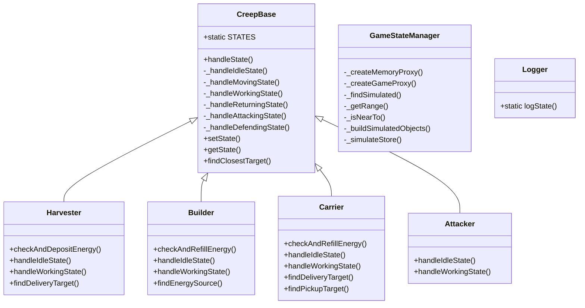

# Архитектура проекта Screeps

## Общее описание

Проект представляет собой AI для игры Screeps, реализующий автоматическое управление колонией.

## Диаграмма классов

## Детальное описание классов

### GameStateManager

GameStateManager
Реализует паттерн Proxy для абстракции доступа к игровым объектам.
Поддерживает два режима работы:
1. Production - работа с реальными объектами Game/Memory
2. Debug - работа с симулированными объектами из JSON

**Используемые паттерны:**
- Proxy Pattern - контроль доступа к объекту

**Жизненный цикл:**
- _createMemoryProxy
- _createGameProxy

**Потоки данных:**
- Передает данные от GameStateManager к Math
- Передает данные от GameStateManager к pos1
- Передает данные от GameStateManager к pos2

#### Методы

- `private _createMemoryProxy(): void`
  Реализует паттерн Proxy для абстракции доступа к памяти игры.
В режиме отладки использует данные из state.memory,
в production режиме - напрямую обращается к глобальному объекту Memory.
  **Использует:** `this.state`
- `private _createGameProxy(): void`
  Реализует паттерн Proxy для абстракции доступа к игровым объектам.
Поддерживает все основные операции с игровыми объектами:
- Доступ к крипам, спавнам, структурам
- Поиск объектов в комнатах
- Работа с ресурсами и строительством
  **Использует:** `this.state.game`, `this.state`, `this.state.game.creeps[name]`, `this.state.game.spawns[name]`, `originPos`, `candidates`, `candidate`
- `private _findSimulated(): void`
  Имитирует работу Game.find() для симулированных объектов.
Поддерживает поиск:
- Враждебных крипов
- Источников энергии
- Выпавших ресурсов
- Строящихся объектов
- Структур
- Спавнов
  **Использует:** `this.state.game`, `this.state`, `opts`, `roomData`, `results`, `roomData.hostileCreeps`, `hc`, `roomData.sources`, `s`, `roomData.droppedResources`, `r`, `roomData.constructionSites`, `cs`, `structure.pos`, `structure`, `this.state.game.spawns[name]`, `spawn.pos`, `spawn`, `console`
- `private _getRange(): void`
  **Использует:** `Math`, `pos1`, `pos2`
- `private _isNearTo(): void`
- `private _buildSimulatedObjects(): void`
  Создает полноценные объекты с методами для симуляции
на основе сырых данных из JSON. Поддерживает:
- Крипов с методами move, say, harvest и т.д.
- Структуры с методами transfer, store и т.д.
- Ресурсы и другие игровые объекты
  **Использует:** `this.state.game`, `this.state`, `this.state.memory`, `creepData`, `target`, `constants`, `console`, `targetPosOrObject`, `structData`, `spawnData`, `Object`, `body`, `spawnObject`, `creep`, `targetCreep`, `roomData`, `roomData.sources`, `sourceData`, `roomData.constructionSites`, `csData`, `roomData.hostileCreeps`, `hcData`, `controllerData`, `storageData`, `Object.keys(this.simulatedObjects)`
- `private _simulateStore(): void`
  Создает объект с методами для работы с хранилищем
(transfer, withdraw и т.д.) на основе данных из JSON.
  **Использует:** `simulatedStore`, `storeData`

### CreepBase

CreepBase
Базовый класс, от которого наследуются все типы крипов.
Реализует общую логику поведения и управления состоянием.
Использует паттерн State для переключения между различными режимами работы.

**Используемые паттерны:**
- State Pattern - управление состоянием объекта

**Жизненный цикл:**
- handleState
- _handleIdleState
- _handleMovingState
- _handleWorkingState
- _handleReturningState
- _handleAttackingState
- _handleDefendingState

**Состояния:**
- 

**Потоки данных:**
- Передает данные от CreepBase к this.memory
- Передает данные от CreepBase к CreepBase.STATES
- Передает данные от CreepBase к CreepBase
- Передает данные от CreepBase к this.creep
- Передает данные от CreepBase к this.memory
- Передает данные от CreepBase к this.gameState.game
- Передает данные от CreepBase к this.gameState
- Передает данные от CreepBase к this.creep

#### Свойства

- `STATES`: any

#### Методы

- `public handleState(): void`
  Основной метод обработки состояния крипа.
Вызывает соответствующий обработчик в зависимости от текущего состояния.
Реализует паттерн State для управления поведением.
  **Использует:** `this.gameState.game`, `this.gameState`, `this.creep`, `console`, `this.memory`, `CreepBase.STATES`, `CreepBase`
- `private _handleIdleState(): void`
  Определяет следующее действие крипа в состоянии ожидания.
Может переключить крипа в состояние движения или работы.
  **Использует:** `console`, `this.creep`, `this.memory`
- `private _handleMovingState(): void`
  Управляет движением крипа к целевой позиции.
Переключает состояние на работу при достижении цели.
  **Использует:** `this.memory`, `CreepBase.STATES`, `CreepBase`, `this.gameState.game`, `this.gameState`, `console`, `this.creep`, `this.creep.pos`, `target`
- `private _handleWorkingState(): void`
  Выполняет основное действие крипа (сбор ресурсов, строительство и т.д.).
Переключает состояние на возврат при необходимости.
  **Использует:** `console`, `this.creep`, `this.memory`
- `private _handleReturningState(): void`
  Управляет возвратом крипа на базу.
Переключает состояние на ожидание при достижении базы.
- `private _handleAttackingState(): void`
  Управляет атакой крипа на цель.
Переключает состояние на ожидание при уничтожении цели.
- `private _handleDefendingState(): void`
  Управляет защитой крипом указанной позиции.
Переключает состояние на атаку при появлении врагов.
- `public setState(): void`
  Изменяет состояние крипа и обновляет его память.
Используется для переключения между различными режимами работы.
  **Использует:** `this.memory`, `CreepBase.STATES`, `CreepBase`, `this.creep`
- `public getState(): void`
  Возвращает текущее состояние крипа из его памяти.
  **Использует:** `this.memory`
- `public findClosestTarget(): void`
  **Использует:** `this.gameState.game`, `this.gameState`, `this.creep`

### Harvester

**Наследуется от:** `CreepBase`

**Жизненный цикл:**
- handleIdleState
- handleWorkingState

**Состояния:**
- Idle
- Working

**Потоки данных:**
- Передает данные от Harvester к structure
- Передает данные от Harvester к structure.store
- Передает данные от Harvester к this.gameState.game
- Передает данные от Harvester к this.gameState
- Передает данные от Harvester к this.creep.pos
- Передает данные от Harvester к this.creep
- Передает данные от Harvester к room
- Передает данные от Harvester к room.storage.store
- Передает данные от Harvester к room.storage

#### Методы

- `public checkAndDepositEnergy(): void`
  **Использует:** `this.memory`, `this.creep.store`, `this.creep`, `CreepBase`
- `public handleIdleState(): void`
  **Использует:** `this.memory`, `target`, `console`, `this.creep`, `CreepBase`, `this.gameState.game`, `this.gameState`, `source`
- `public handleWorkingState(): void`
  **Использует:** `this.memory`, `CreepBase`, `this.gameState.game`, `this.gameState`, `console`, `this.creep`, `this.creep.store`, `target`
- `public findDeliveryTarget(): void`
  **Использует:** `structure`, `structure.store`, `this.gameState.game`, `this.gameState`, `this.creep.pos`, `this.creep`, `room`, `room.storage.store`, `room.storage`

### Builder

**Наследуется от:** `CreepBase`

**Жизненный цикл:**
- handleIdleState
- handleWorkingState

**Состояния:**
- Idle
- Working

#### Методы

- `public checkAndRefillEnergy(): void`
  **Использует:** `this.creep.store`, `this.creep`, `this.memory`, `CreepBase`
- `public handleIdleState(): void`
  **Использует:** `this.memory`, `energySource`, `CreepBase`, `this.creep`, `console`, `constructionSite`
- `public handleWorkingState(): void`
  **Использует:** `this.memory`, `CreepBase`, `this.gameState.game`, `this.gameState`, `console`, `this.creep`, `target`
- `public findEnergySource(): void`
  **Использует:** `s`, `s.store`, `console`, `this.creep`, `source`

### Carrier

**Наследуется от:** `CreepBase`

**Жизненный цикл:**
- handleIdleState
- handleWorkingState

**Состояния:**
- Idle
- Working

**Потоки данных:**
- Передает данные от Carrier к structure
- Передает данные от Carrier к structure.store
- Передает данные от Carrier к this.gameState.game
- Передает данные от Carrier к this.gameState
- Передает данные от Carrier к this.creep.pos
- Передает данные от Carrier к this.creep
- Передает данные от Carrier к room
- Передает данные от Carrier к room.storage.store
- Передает данные от Carrier к room.storage
- Передает данные от Carrier к r
- Передает данные от Carrier к s
- Передает данные от Carrier к s.store
- Передает данные от Carrier к this.gameState.game
- Передает данные от Carrier к this.gameState
- Передает данные от Carrier к this.creep.pos
- Передает данные от Carrier к this.creep
- Передает данные от Carrier к room
- Передает данные от Carrier к room.storage.store
- Передает данные от Carrier к room.storage

#### Методы

- `public checkAndRefillEnergy(): void`
  **Использует:** `this.memory`, `this.creep.store`, `this.creep`, `CreepBase`
- `public handleIdleState(): void`
  **Использует:** `this.memory`, `target`, `console`, `this.creep`, `CreepBase`
- `public handleWorkingState(): void`
  **Использует:** `this.memory`, `CreepBase`, `this.gameState.game`, `this.gameState`, `console`, `this.creep`, `this.creep.store`, `target`
- `public findDeliveryTarget(): void`
  **Использует:** `structure`, `structure.store`, `this.gameState.game`, `this.gameState`, `this.creep.pos`, `this.creep`, `room`, `room.storage.store`, `room.storage`
- `public findPickupTarget(): void`
  **Использует:** `r`, `s`, `s.store`, `this.gameState.game`, `this.gameState`, `this.creep.pos`, `this.creep`, `room`, `room.storage.store`, `room.storage`

### Attacker

**Наследуется от:** `CreepBase`

**Жизненный цикл:**
- handleIdleState
- handleWorkingState

**Состояния:**
- Idle
- Working

#### Методы

- `public handleIdleState(): void`
  **Использует:** `console`, `this.creep`, `enemy`, `this.memory`, `CreepBase`
- `public handleWorkingState(): void`
  **Использует:** `this.memory`, `CreepBase`, `this.gameState.game`, `this.gameState`, `target`, `console`, `this.creep`

### Logger

#### Методы

- `public static logState(): void`
  **Использует:** `new Date()`, `gameInstance`, `JSON`, `state.game`, `state`, `creep`, `creep.memory`, `creep.body`, `part`, `structure`, `spawn`, `spawn.spawning`, `room`, `room.controller`, `room.storage`, `room.find(FIND_SOURCES)`, `s`, `room.find(FIND_CONSTRUCTION_SITES)`, `cs`, `room.find(FIND_HOSTILE_CREEPS)`, `hc`, `hc.body`, `p`, `console`

## Используемые паттерны и принципы

- **Proxy Pattern - контроль доступа к объекту**
- **State Pattern - управление состоянием объекта**

