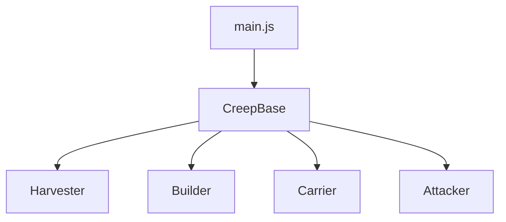
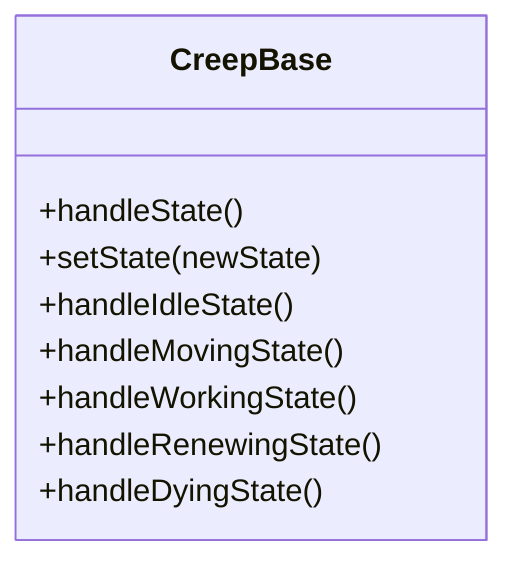
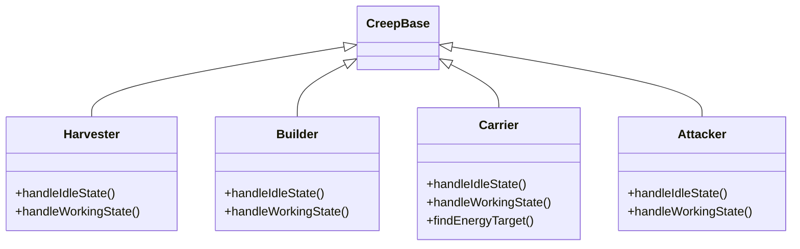
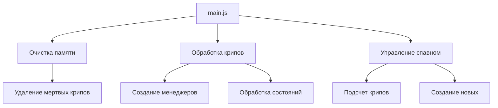
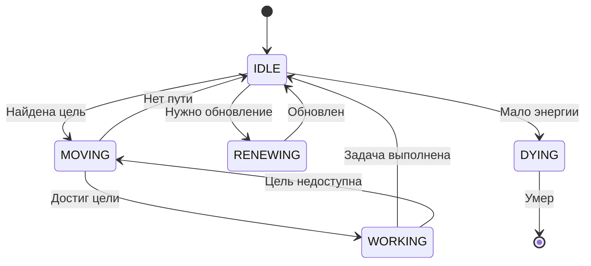
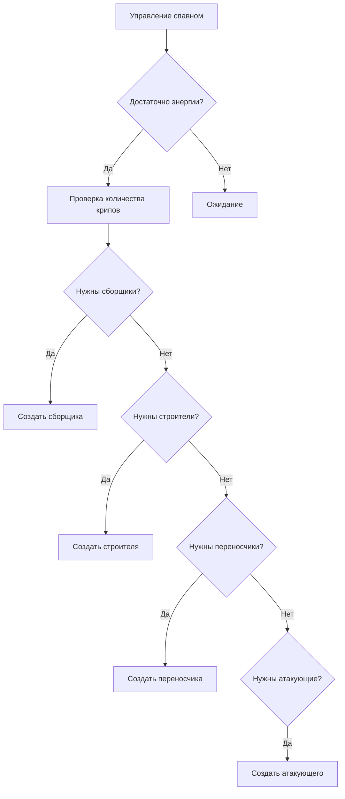
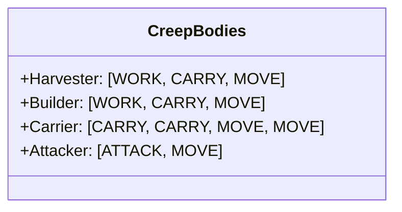
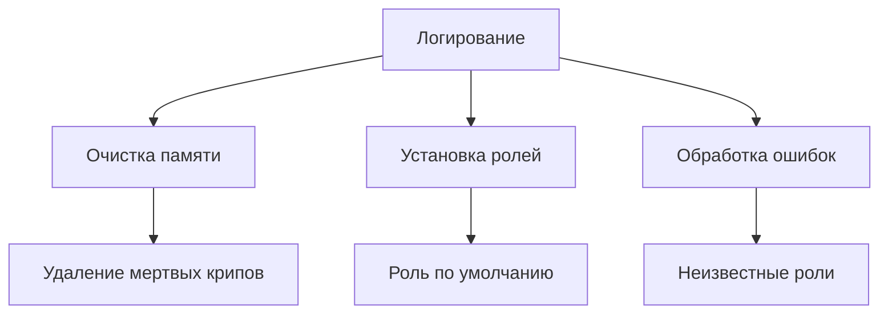

# Архитектура проекта Screeps

## Общая структура

Проект построен на основе объектно-ориентированного подхода с использованием классов для управления различными типами крипов.

## Основные компоненты

### 1. Базовый класс крипа (CreepBase.js)

- Содержит общую логику для всех типов крипов
- Определяет основные состояния крипа:
  - IDLE (ожидание)
  - MOVING (передвижение)
  - WORKING (работа)
  - RENEWING (обновление)
  - DYING (смерть)
- Реализует базовые методы для управления состояниями

### 2. Специализированные классы крипов

#### Harvester (Harvester.js)
- Сборщик энергии
- Основные функции:
  - Поиск ближайшего активного источника энергии
  - Добыча энергии
  - Перемещение к источнику

#### Builder (Builder.js)
- Строитель
- Основные функции:
  - Поиск ближайшей стройплощадки
  - Строительство структур
  - Перемещение к стройплощадке

#### Carrier (Carrier.js)
- Переносчик
- Основные функции:
  - Поиск целей для переноса энергии
  - Перенос энергии между структурами
  - Приоритеты целей:
    1. Хранилище (storage)
    2. Контроллер для улучшения
    3. Спавнеры и расширения

#### Attacker (Attacker.js)
- Атакующий
- Основные функции:
  - Поиск вражеских крипов
  - Атака врагов
  - Перемещение к цели

### 3. Основной файл (main.js)

- Управляет всем игровым циклом
- Основные функции:
  - Очистка памяти мертвых крипов
  - Создание и управление крипами
  - Управление спавном новых крипов
  - Распределение ролей

## Система состояний крипов

Каждый крип может находиться в одном из следующих состояний:
1. IDLE - ожидание новой задачи
2. MOVING - перемещение к цели
3. WORKING - выполнение основной задачи
4. RENEWING - обновление в спавнере
5. DYING - подготовка к смерти

## Управление спавном

Система автоматически создает крипов в зависимости от потребностей:
- Приоритеты создания:
  1. 2 сборщика энергии
  2. 1 строитель
  3. 2 переносчика
  4. 1 атакующий

## Конфигурация тел крипов

Каждый тип крипа имеет оптимальную конфигурацию тела:
- Сборщики и строители: WORK, CARRY, MOVE
- Переносчики: CARRY, CARRY, MOVE, MOVE
- Атакующие: ATTACK, MOVE

## Логирование

Система включает в себя базовое логирование:
- Очистка памяти мертвых крипов
- Установка ролей по умолчанию
- Обработка ошибок и неизвестных ролей