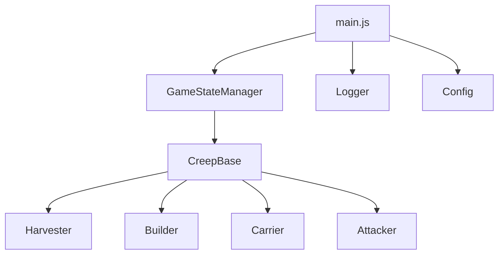
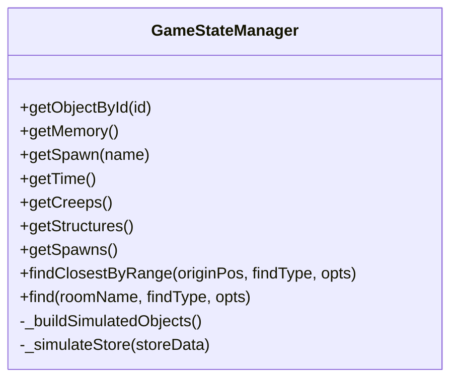
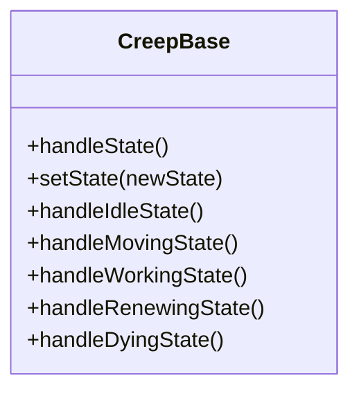
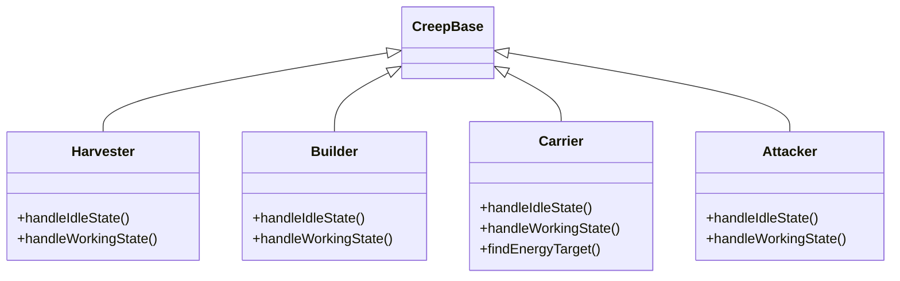
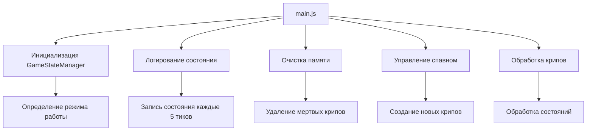
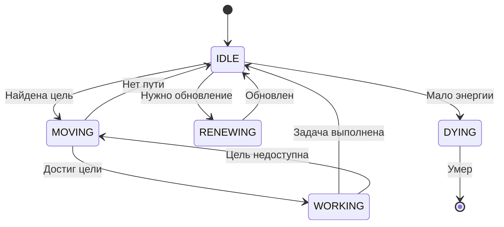
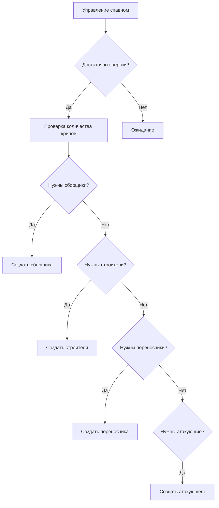
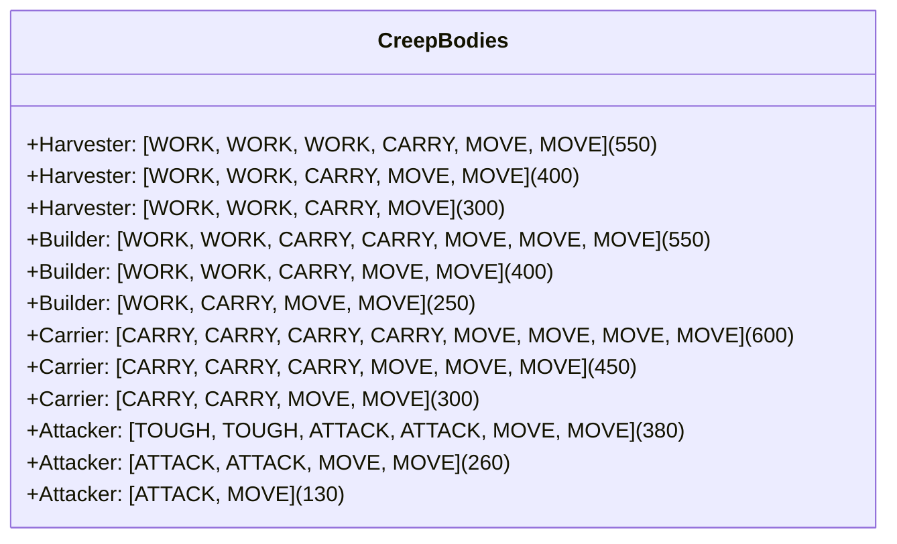
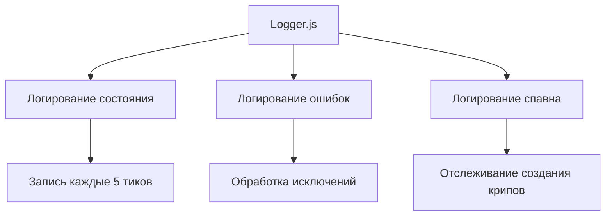

# Архитектура проекта Screeps

## Общая структура

Проект построен на основе объектно-ориентированного подхода с использованием классов для управления различными типами крипов и состояниями игры.

## Основные компоненты

### 1. Менеджер состояния игры (GameStateManager.js)

- Управляет состоянием игры в режиме отладки и продакшена
- Предоставляет унифицированный интерфейс для работы с игровыми объектами
- Реализует симуляцию игровых методов для отладки
- Управляет памятью игры

### 2. Базовый класс крипа (CreepBase.js)

- Содержит общую логику для всех типов крипов
- Определяет основные состояния крипа:
  - IDLE (ожидание)
  - MOVING (передвижение)
  - WORKING (работа)
  - RENEWING (обновление)
  - DYING (смерть)
- Реализует базовые методы для управления состояниями

### 3. Специализированные классы крипов

#### Harvester (Harvester.js)
- Сборщик энергии
- Основные функции:
  - Поиск ближайшего активного источника энергии
  - Добыча энергии
  - Перемещение к источнику

#### Builder (Builder.js)
- Строитель
- Основные функции:
  - Поиск ближайшей стройплощадки
  - Строительство структур
  - Перемещение к стройплощадке

#### Carrier (Carrier.js)
- Переносчик
- Основные функции:
  - Поиск целей для переноса энергии
  - Перенос энергии между структурами
  - Приоритеты целей:
    1. Хранилище (storage)
    2. Контроллер для улучшения
    3. Спавнеры и расширения

#### Attacker (Attacker.js)
- Атакующий
- Основные функции:
  - Поиск вражеских крипов
  - Атака врагов
  - Перемещение к цели

### 4. Основной файл (main.js)

Основные функции:
- Инициализация менеджера состояния игры
- Логирование состояния (каждые 5 тиков)
- Очистка памяти мертвых крипов
- Управление спавном новых крипов
- Обработка всех крипов и их состояний

### 5. Система состояний крипов

Каждый крип может находиться в одном из следующих состояний:
1. IDLE - ожидание новой задачи
2. MOVING - перемещение к цели
3. WORKING - выполнение основной задачи
4. RENEWING - обновление в спавнере
5. DYING - подготовка к смерти

### 6. Управление спавном

Система автоматически создает крипов в зависимости от потребностей:
- Приоритеты создания:
  1. 2 сборщика энергии
  2. 2 переносчика
  3. 1 строитель
  4. 0 атакующих (по умолчанию)

### 7. Конфигурация тел крипов

Каждый тип крипа имеет несколько конфигураций тела в зависимости от доступной энергии:
- Сборщики: от 300 до 550 энергии
- Строители: от 250 до 550 энергии
- Переносчики: от 300 до 600 энергии
- Атакующие: от 130 до 380 энергии

### 8. Логирование

Система логирования включает:
- Периодическое логирование состояния игры
- Логирование ошибок и исключений
- Отслеживание процесса спавна крипов
- Запись важных событий в консоль